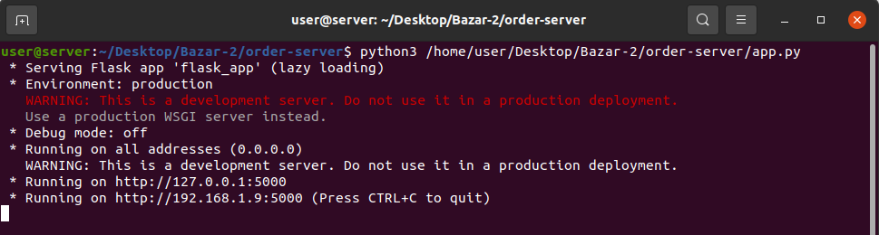

# DOS-PROJECT
# Bazar - online book store
Bazar is an Online book store that works with microservices.
## Introduction 
The store will employ a two-tier web design - a front-end and a back- end - and use microservices at each tier. The front-end tier will accept user requests and perform initial processing. The backend consists of two components: a catalog server and an order server.

Where this store works with Microservices - also known as the microservice architecture - is an architectural style that structures an application as a collection of services that are
1. Highly maintainable and testable.
2. Loosely coupled.
3. Independently deployable.
4. Organized around business capabilities.
5. Owned by a small team.
    
    
---
# How to run this project: 
### First: setup your environment.
in this project, we need to setup five machines, where each one works with others. where its recommended to be at the same network, or make a virtual environments. using **VMware** or **VirtualBox** for example. 


### Second : Installation.
First, make sure that you have **Python** installed on your device(s).

Next, make sure that you have **pip** if you don't have it on your device from [here](https://pip.pypa.io/en/stable/installing/).

On each virtual environment that works as a microservice is in its own folder. --> on CLI:  
```
git clone https://github.com/MohammadAQ/DOS-
```

For each machine, install the required Python packages using pip:
```
pip3 install -r requirements.txt
```
---

# Networking 
In this project, we will use the same **NIC** on all machines. **BRIDGE** for example. 
## First you need to edit the `flask_app` file on each machine by adding the other machines addresses. as shown in the table below.

Environment Variable | Description | 
-------------------- | ----------- | 
`CATALOG_ADDRESS` | The address of the catalog service. Used in the order and front-end services. 
`ORDER_ADDRESS` | The address of the order service. Used in the front-end and catalog services. 
`FRONT_END_ADDRESS` | The address of the front-end service. Used in the catalog and order services.
`FLASK_ENV` | Define the enviroment of the Flask application. Can be `development` or `production`. `development` enables the use of debug mode.
`FLASK_DEBUG` | Enable debug mode or not. In debug mode, modifications to the Flask application files automatically refreshes the service. Requires `FLASK_ENV` to be set to `development`. Can be `True` or `False`. 
`FLASK_PORT` | Define the port number used by the microservice. 

## Next, after setting up all the above simply you can run this project by executing this command on each machine.
```
python3 ./app.py
```
**Note** if not work, you need to but the path to the `app.py` file. it should work. **See Figure Bleow**
 **running the microservice** where you should make the same thing on all machines.


---

# Request Examples.
**Note**: **Postman** is a good tool for making Restful-API methods.or you can do it with **CURL** tool. 


---

### 1. Search with query `t`

#### cURL Request

```
curl -H "Content-Type: application/json" --request GET http://192.168.1.15:5000/search/t
```

#### Response

`200`
```json
[
  {
    "id": 1,
    "title": "How to get a good grade in DOS in 40 minutes a day",
    "topic": "Distributed Systems"
  },
  {
    "id": 2,
    "title": "RPCs for Noobs",
    "topic": "Distributed Systems"
  },
  {
    "id": 3,
    "title": "Xen and the Art of Surviving Undergraduate School",
    "topic": "Graduate School"
  },
  {
    "id": 4,
    "title": "Cooking for the Impatient Undergrad",
    "topic": "Graduate School"
  }
]
```

---


### 2. searching for word Distributed.

#### cURL Request

```
curl -H "Content-Type: application/json" --request GET http://192.168.1.15:5000/search/distributed
```

#### Response

`200`
```json
[
  {
    "id": 1,
    "title": "How to get a good grade in DOS in 20 minutes a day",
    "topic": "Distributed Systems"
  },
  {
    "id": 2,
    "title": "RPCs for Dummies",
    "topic": "Distributed Systems"
  }
]
```
---


# Caching
A Python dictionary (dict) and list were used to implement caching in the front-end server (list). The dictionary will contain the cache's key-value pairs, while the list will serve as a Least Recently Used (LRU) queue for the cache replace policy.

## Caching Search 
Caching search results is more difficult because changes to a book can invalidate an entire subject (although, in Bazar, updates don't impact fields that are returned in search results, so invalidating isn't necessary, but I did it anyway).
I solved this problem by making the key the search term, and the entry the JSON response of the search operation, as well as a list of all topics covered in that response.
When the catalog server sends an invalidate request to the front-end server for a topic, all cached items are checked for their topic set, and all topic sets that include that topic are erased. 
A new end-point was implemented that allows catalog servers to entirely clean the cache. This is helpful if a new book is needed in the future.

## Replication

### Catalog Servers and Order Servers

For replication on catalog server , we made two servers for it. so for the catalog servers we have two addresses.**Note** the two machines IPs . as below.


Variable | Example
---------| -------
`CATALOG_ADDRESSES` | `http://192.168.1.16\| http://192.168.1.17`
`CATALOG_ADDRESSES` | `http://192.168.1.19\| http://192.168.1.20`

